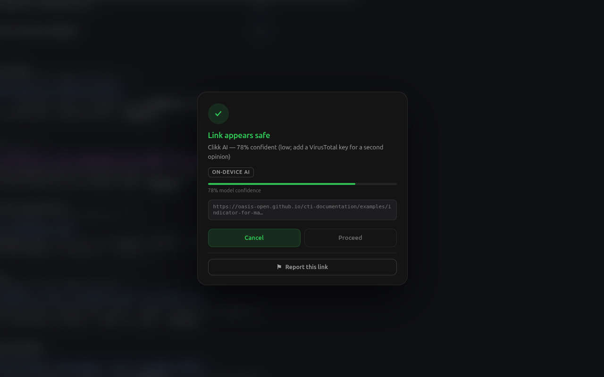

# Clikk

**A Chrome extension that detects phishing and malicious links before you click — with the ML model running entirely on your device.**

[**Install from the Chrome Web Store**](https://chromewebstore.google.com/detail/ebnadedjcjlnhbdcfogbglecfoimhmom) · [Privacy policy](PRIVACY.md)



Clikk intercepts link clicks on any webpage, scans the URL through a layered local-first pipeline, and shows a verdict card — safe / suspicious / dangerous — with a confidence meter and the source of the verdict, before the navigation happens. Links get badges at page load, hover triggers a local pre-scan so click-time verdicts feel instant, and a banner warns you when the site you're *on* looks unsafe.

By default nothing leaves your device: blocklists, heuristics, and the ML model all run locally. VirusTotal is consulted only when the model is unsure *and* you've added your own API key. No accounts, no analytics, telemetry off by default.

---

## How a click gets scanned

Cheap and local first, network last:

```
click → in-memory cache (1 hr TTL)
      → local blocklists in IndexedDB, refreshed daily
          · URLhaus     (malware URLs)
          · OpenPhish   (phishing feed)
          · ThreatFox   (threat IOCs)
      → heuristics for India-specific scams
          (fake KYC / UPI patterns, sketchy TLDs, deep subdomains)
      → on-device ML model
          · p ≤ 0.10 or p ≥ 0.90  →  model decides alone, done
          · otherwise             →  fall through
      → VirusTotal (only if a key is configured; free-tier friendly)
```

Because the model resolves the overwhelming majority of URLs on its own, most verdicts never touch the network — which is simultaneously the privacy story and the API-quota story.

---

## The ML deep dive

The interesting part of this project wasn't building the model. It was discovering how easy it is to fool yourself — three separate times, in three separate places: the model, the data, and the deployment.

### Attempt 1: SecureBERT, rejected with evidence

The first classifier was [SecureBERT](https://huggingface.co/ehsanaghaei/SecureBERT) (a security-domain BERT) fine-tuned on a public URL dataset. Accuracy was excellent. Too excellent.

Diagnostics showed the model wasn't learning what makes a URL malicious — it was **shortcut learning**: memorizing which domains appeared in which class of the training data, then recognizing them again at test time. The standard random train/test split let the same domains appear on both sides, so the "accuracy" was mostly memory. Tested on URLs from domains it had never seen, performance collapsed.

The attempt is archived, diagnostics and all, in [`linkguard-model/archive/`](linkguard-model/archive/). Two lessons came out of it:

1. **Split by domain, not by URL.** Every evaluation since uses grouped splits (`GroupShuffleSplit` on the registrable domain) so no domain leaks between train and test.
2. **A great score on a leaky split is worse than useless** — it's actively misleading, because it tells you to ship a model that doesn't work.

### The data was also lying

Auditing candidate training data turned up a bigger problem: a popular Kaggle malicious-URLs dataset (used in countless public notebooks) appears to have its **labels systematically swapped**. The evidence is pure arithmetic — comparing its labels against trusted threat feeds, the disagreement is almost perfectly symmetric: 48,009 URLs labeled phishing that the feeds call benign, and 47,903 labeled benign that the feeds call phishing — ~99.99% of the overlap, in both directions at once. That's not noise; that's a swap at assembly time.

So the dataset was rebuilt from primary sources instead: **URLhaus, OpenPhish, and ThreatFox** for malicious URLs, with a curated safe set — ~26k URLs total, capped per domain so no single domain dominates, spanning 930 safe and 6,380 malicious domains.

### Attempt 2: the model that shipped

Sometimes simple wins — but "simple" here was a requirement, not a concession. The deployment target is a Manifest V3 **service worker**: no Python, no native libraries, no GPU, and inference has to be effectively free because it can run on every link click. A transformer cannot meet that constraint.

What shipped: **TF-IDF over character n-grams (3–5, `char_wb`) + logistic regression** — 57,750 features, one weight vector, one sigmoid.

Evaluated on a domain-grouped 20% test split (5,249 URLs, zero domain overlap with training):

| Metric | Value |
|---|---|
| Accuracy | **98.6%** |
| False-positive rate | **0.3%** (8 of 2,630 safe URLs) |
| Inference | **~200 µs per URL** |
| Model artifact | **1.7 MB JSON**, sha256-fingerprinted |

Two deliberate design decisions on top of the raw classifier:

- **"Suspicious" is a probability band, not a class.** The model is trained 2-class (safe/dangerous); verdicts in the 0.30–0.70 band render as *suspicious*. Training a 3-class model would force fake certainty about an inherently fuzzy middle.
- **Ignorance fails safe.** A URL composed entirely of never-seen character chunks scores p ≈ 0.559 — which lands in the suspicious band. When the model knows nothing, it says "be careful," never "safe."

### Deployment, with proof

To run on-device, the trained scikit-learn model was exported to a versioned JSON artifact ([`model/linkguard_model_v1.json`](model/linkguard_model_v1.json)) and inference was **reimplemented from scratch in dependency-free JavaScript** ([`model.js`](model.js)) — including scikit-learn's exact tokenization quirks: code-point (not byte) slicing, Python's Unicode whitespace class, `char_wb`'s short-word behavior, and L2-norm folding.

A rewrite like this can silently diverge in a hundred small ways, so it's gated by two tests:

1. **Golden vectors** — 100 URLs with Python-computed probabilities must match within 1e-6:
   ```
   node linkguard-model/deploy/parity_test.mjs
   ```
2. **Exhaustive replay** — the *entire* 5,249-URL final test set pushed through both the Python and JS implementations:
   ```
   node linkguard-model/deploy/full_parity_test.mjs
   ```
   Result: identical predictions on all 5,249, identical confusion matrix, **maximum probability difference 2×10⁻⁸**, zero verdict-band flips.

The JS engine's measured accuracy is therefore not "expected to be" the Python model's accuracy — it is *provably the same number*, because every test example produces the same output in both.

> The hardest part isn't training a model — it's proving your model, your data, and your deployment aren't quietly lying to you.

---

## Repository layout

```
manifest.json               MV3 manifest
background.js               service worker: blocklist manager (IndexedDB),
                            scan pipeline, VirusTotal client, verdict cache
content.js                  click interception, badges, verdict overlay, host banner
content.css                 in-page UI (monochrome design system)
model.js                    zero-dependency JS inference engine
model/
  linkguard_model_v1.json   exported model artifact (TF-IDF vocab + weights)
popup.html / popup.js       toolbar popup: dashboard, settings, help
linkguard-model/
  data/                     dataset assembly + audits (incl. the Kaggle forensics)
  train/                    training, grouped evaluation, JSON export
  deploy/                   both parity gates + golden/full test vectors
  archive/                  the failed SecureBERT attempt, kept honest
supabase/                   community-blocklist backend (schema + edge function)
tools/                      icon generator, store packaging
store/                      Chrome Web Store listing kit + screenshots
```

Internal identifiers still say "linkguard" (IndexedDB name, `lg-` CSS prefixes, model file names) — the product was renamed to Clikk late in development, and renaming storage keys would break existing installs for zero user value.

## Development setup

1. `chrome://extensions` → enable Developer mode → **Load unpacked** → select this folder
2. Optional: popup → Settings → add a free [VirusTotal API key](https://www.virustotal.com/gui/my-apikey) for second opinions on uncertain URLs
3. Browse anywhere — links get badges; click any link to scan it

Packaging a store build: `bash tools/package.sh` → `dist/clikk-v0.7.0.zip`.

## Roadmap

- **Model v2** — larger, shape-balanced dataset (Phishing.Database + PhiUSIIL phishing set, with the same audit gates) to close the phishing-recall gap
- **Community blocklist** — Supabase backend (schema already in repo) with strictly opt-in threat sharing
- **Android app** — same pipeline for links from SMS/WhatsApp, sharing the on-device model
